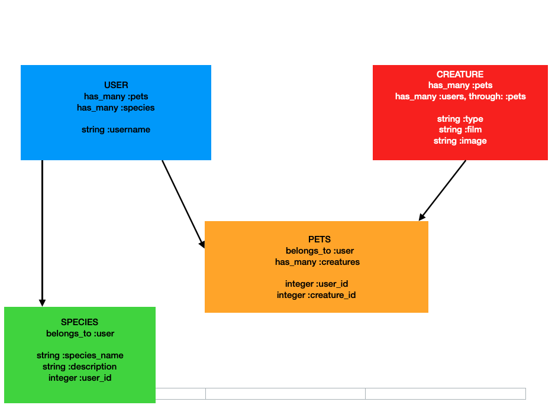
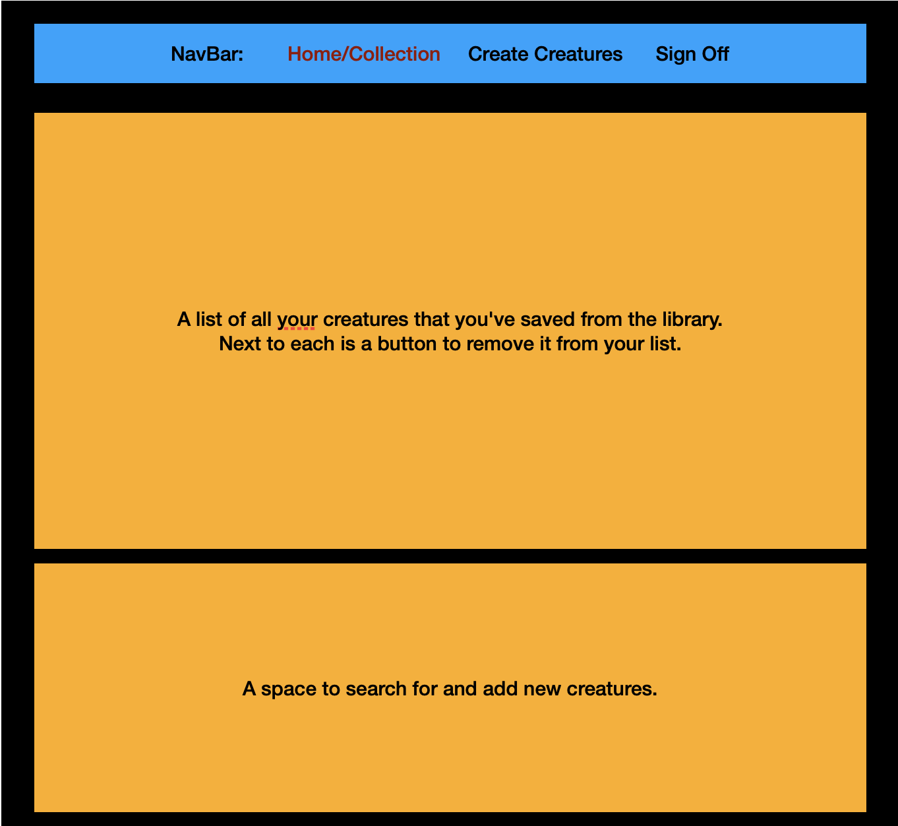
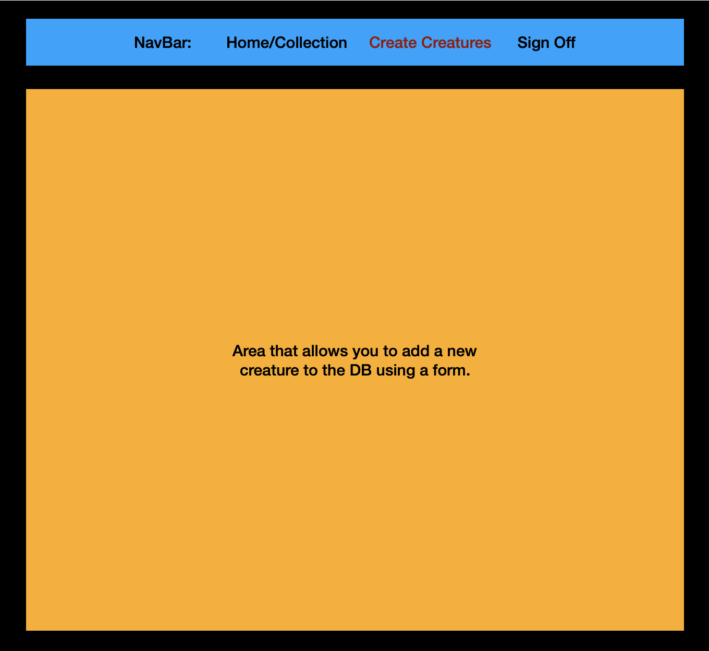

# 🪐 C3PO's Curiosities 🪐

### Flatiron Project 3, Michelle Caraballo & Erin Van Brunt

## Summary:

This app will feature a front-end and back-end in separate github repos. The front-end will be written in
HTML, CSS, ReactJSX and JS. The back-end will be created using Ruby, Sinatra and Active Record. It will be Star Wars themed,
and will show 3CPO's library of creatures. It will be one to two pages, and let the user interact with the DB.

## User Story:

1. You pull up the browser and sees 3CPO's opening page. Then read that you can view, create or save creatures
   from the Star Wars universe once you log in. You have the option to sign in.

2. You sign in and your name is displayed on the home page, as well as a area that would show your collection.
   Next to it is a button that offers "Add to Your Collection." You have a navigation bar at the top that reads 2 options:
   A. "Home/Creature Collection", B. "Create Creature", C. "Sign Out"
   (A is highlighted. What ever page you are in on the nav bar is highlighted.)

3. You choose to "Add to Your Collection." The interface allows you to look through the database and choose what you
   you'd like to add. After adding some creatures, you see that you also have the option to delete them using a button
   next to where they are displayed.

4. You go to the the navigation bar after words and select "Create Creature". There is a form to create a new
   creature that is added to the db and automatically saved to your collection.

5. You then click "Sign Out" and return to the very first page rendered.

## Wire Frames:

## References

- SWAPI Star Wars API, to use data to seed: https://swapi.dev/
- Disney Wiki: https://disney.fandom.com/wiki/Category:Star_Wars_creatures
